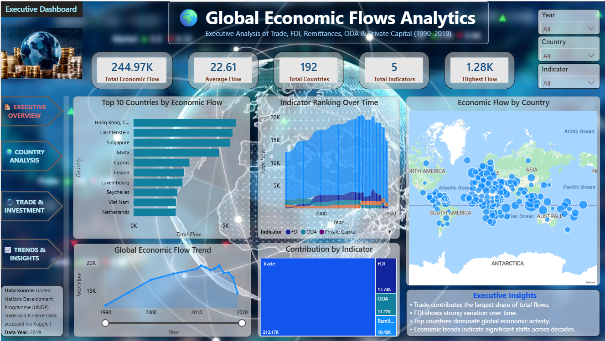
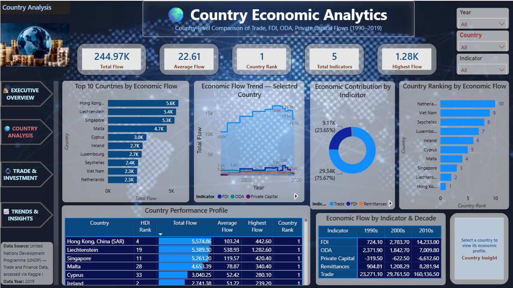
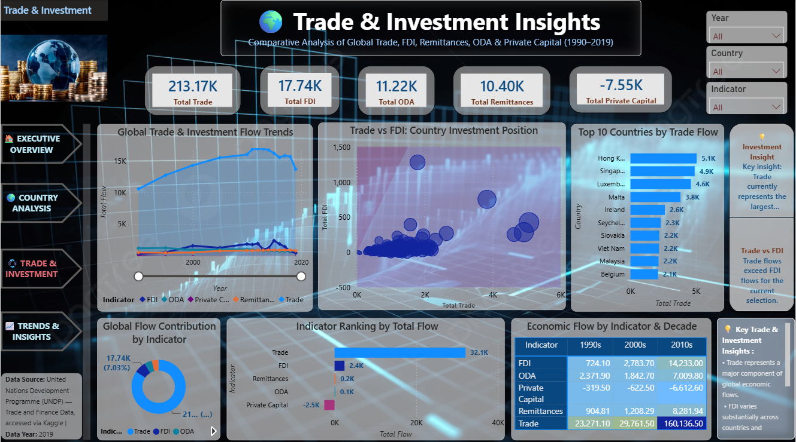
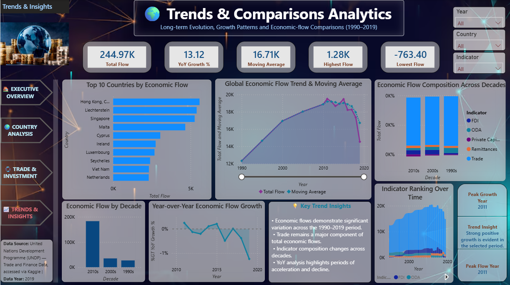

# 🌍 Global Economic Flows & Economic Development Analytics Dashboard

[](https://powerbi.microsoft.com/)
[](https://learn.microsoft.com/en-us/dax/)
[](https://learn.microsoft.com/en-us/power-query/)
[](https://github.com/)

An interactive **Power BI analytics dashboard** designed to explore and communicate global economic flows and economic development patterns across countries and over time.

The project brings together multiple dimensions of international economic activity, including **global trade, Foreign Direct Investment (FDI), Official Development Assistance (ODA), remittances and private capital flows**, and transforms them into an interactive business intelligence solution.

---

# 📸 Dashboard Preview

The dashboard contains **four analytical pages**, supported by high-resolution PNG previews.

## 1️⃣ Executive Overview

[](Dashboard_Images/01_Executive_Overview.png)

**[🔎 Open Executive Overview](Dashboard_Images/01_Executive_Overview.png)**

Provides a high-level view of global economic flows through executive KPIs, country comparisons and major economic indicators.

---

## 2️⃣ Country Analysis

[](Dashboard_Images/02_Country_Analysis.png)

**[🔎 Open Country Analysis](Dashboard_Images/02_Country_Analysis.png)**

Explores differences between countries and regions, enabling users to investigate economic flows and development indicators at country level.

---

## 3️⃣ Trade & Investment

[](Dashboard_Images/03_Trade_Investment.png)

**[🔎 Open Trade & Investment](Dashboard_Images/03_Trade_Investment.png)**

Analyses international trade and investment patterns, highlighting relationships between countries and the movement of capital across economies.

---

## 4️⃣ Trends & Comparisons

[](Dashboard_Images/04_Trends_Comparisons.png)

**[🔎 Open Trends & Comparisons](Dashboard_Images/04_Trends_Comparisons.png)**

Examines economic trends over time and supports comparison between countries, regions and economic-flow categories.

---

# 📌 Project Overview

Global economic activity involves multiple interconnected flows of money, goods, investment and development assistance.

This project uses **Power BI** to transform complex economic-flow data into an interactive analytical environment that allows users to explore:

- Global trade activity
- Foreign Direct Investment (FDI)
- Official Development Assistance (ODA)
- Remittance flows
- Private capital flows
- Country-level economic patterns
- Regional comparisons
- Long-term trends
- Cross-country differences

The dashboard is designed to support **data-driven exploration, comparison and decision-making** through interactive visualisations, KPIs, filters and analytical views.

---

# ⭐ Project Highlights

✔ Interactive Power BI Dashboard

✔ 4 Professional Analytical Dashboard Pages

✔ Executive-Level KPI Reporting

✔ Country-Level Economic Analysis

✔ Trade & Investment Analysis

✔ Economic Trend Analysis

✔ Interactive Filtering & Exploration

✔ Data Transformation using Power Query

✔ Analytical Measures using DAX

✔ Professional Data Visualisation

✔ Business Intelligence & Data Storytelling

✔ PDF Executive Reporting

✔ Full Dashboard Documentation

✔ GitHub-Based Portfolio Presentation

---

# 🎯 Project Objectives

The main objectives of this project are to:

- Analyse global economic flows across countries and time
- Explore international trade patterns
- Examine Foreign Direct Investment flows
- Analyse development assistance and remittance flows
- Compare economic activity between countries and regions
- Identify important economic trends
- Support cross-country comparisons
- Transform complex datasets into accessible business intelligence
- Present economic information through an executive-friendly dashboard

---

# 🛠 Tools & Technologies

| **Tool / Technology** | **Purpose** |
|---|---|
| Microsoft Power BI | Dashboard development and interactive analytics |
| Power Query | Data preparation and transformation |
| DAX | Measures, KPIs and analytical calculations |
| Data Modelling | Structuring data for analytical reporting |
| Power BI Visuals | Interactive data visualisation |
| GitHub | Portfolio presentation and project versioning |
| PDF Reporting | Executive and full dashboard documentation |

---

# 📊 Dashboard Structure

| **Dashboard Page** | **Purpose** |
|---|---|
| Executive Overview | High-level economic-flow KPIs and overall performance |
| Country Analysis | Country-level comparison and economic analysis |
| Trade & Investment | International trade and investment patterns |
| Trends & Comparisons | Time-series trends and comparative analysis |

---

# 📊 Dashboard Pages

## 1️⃣ Executive Overview

The Executive Overview provides a consolidated view of the major economic indicators analysed in the project.

### Key focus areas

- Executive KPI reporting
- Global economic-flow overview
- Country and regional comparison
- High-level performance indicators
- Interactive filtering

This page is designed to provide a quick understanding of the overall economic landscape before moving into detailed analysis.

---

## 2️⃣ Country Analysis

The Country Analysis page provides a more detailed view of economic activity across individual countries and regions.

### Key focus areas

- Country comparisons
- Economic-flow analysis
- Regional differences
- Country-level performance
- Interactive exploration

This allows users to move from a global perspective to a more detailed country-level analysis.

---

## 3️⃣ Trade & Investment

The Trade & Investment page focuses on international economic activity involving trade and investment.

### Key focus areas

- International trade
- Investment flows
- Cross-country relationships
- Economic activity comparison
- Trade and investment patterns

This view helps users understand how economic activity moves between countries and regions.

---

## 4️⃣ Trends & Comparisons

The Trends & Comparisons page focuses on changes over time and comparative analysis.

### Key focus areas

- Economic trends
- Historical comparisons
- Country comparisons
- Regional comparisons
- Flow-category comparisons

This page supports identification of changing patterns and differences across the analysed economic indicators.

---

# 🏆 Dashboard Features

The Power BI solution incorporates a range of business intelligence and visual analytics features.

### 📈 Executive Reporting

- KPI-focused reporting
- High-level economic overview
- Executive-friendly visual design
- Summary-level analysis

### 🌍 Geographic & Country Analysis

- Country-level comparison
- Regional analysis
- Economic-flow exploration
- Cross-country benchmarking

### 💰 Economic Flow Analysis

- Trade analysis
- FDI analysis
- ODA analysis
- Remittance analysis
- Private capital analysis

### 📊 Interactive Analytics

- Interactive filters
- Dynamic visual exploration
- Cross-visual interaction
- Comparative analysis
- Trend analysis

---

# 💡 Analytical Insights

The dashboard is designed to help users investigate questions such as:

- Which countries demonstrate the strongest economic flows?
- How do economic flows differ between countries and regions?
- How does trade activity change over time?
- Where are significant investment flows concentrated?
- How do remittances vary across economies?
- How does development assistance compare between countries?
- Which economic-flow categories show significant changes over time?
- What differences can be observed between countries and regions?

The dashboard allows these questions to be explored interactively rather than relying solely on static reporting.

---

# 💼 Business Value

The solution demonstrates how complex economic datasets can be converted into a practical **Business Intelligence reporting environment**.

Potential business and analytical applications include:

- Executive reporting
- Economic research
- Country benchmarking
- Investment analysis
- International development analysis
- Strategic decision support
- Trend monitoring
- Comparative economic analysis

The project demonstrates the value of combining **data preparation, data modelling, analytical calculations and visual storytelling** within a single BI solution.

---

# 🎯 Skills Demonstrated

## Business Intelligence

- Interactive Dashboard Development
- Executive Reporting
- KPI Development
- Business Intelligence
- Data Storytelling
- Analytical Reporting

## Data Analytics

- Data Cleaning
- Data Transformation
- Exploratory Data Analysis
- Comparative Analysis
- Trend Analysis
- Economic Data Analysis

## Power BI

- Power Query
- DAX
- Data Modelling
- Interactive Visualisations
- Slicers & Filters
- Dashboard Navigation
- KPI Cards
- Report Design

## Data Visualisation

- Executive KPI Visualisation
- Comparative Charts
- Trend Visualisations
- Geographic/Country Analysis
- Interactive Reporting
- Business-Focused Visual Design

---

# 📂 Repository Structure

```text
global-economic-flows-powerbi
│
├── Dashboard_Images/
│   ├── 01_Executive_Overview.png
│   ├── 02_Country_Analysis.png
│   ├── 03_Trade_Investment.png
│   ├── 04_Trends_Comparisons.png
│   └── README.md
│
├── PowerBI/
│   └── Global Capital Flows & Economic Development Analytics Dashboard.pbix
│
├── Global_Economic_Flows_Executive_Report.pdf
├── Global_Economic_Flows_Full_Dashboard_Report.pdf
└── README.md
```

---

# 📄 Documentation

The project documentation is available below:

- 📘 [Executive Dashboard Report](./Global_Economic_Flows_Executive_Report.pdf)
- 📊 [Full Dashboard Report](./Global_Economic_Flows_Full_Dashboard_Report.pdf)

---

## 💻 Power BI Dashboard

The complete interactive Power BI dashboard is available below.

📥 **Download the Power BI Dashboard**

[**Global Capital Flows & Economic Development Analytics Dashboard.pbix**](./Global%20Capital%20Flows%20%26%20Economic%20Development%20Analytics%20Dashboard.pbix)

> Open the file using **Microsoft Power BI Desktop** to explore the complete interactive dashboard.

---

# 📸 Dashboard Previews

## 1️⃣ Executive Overview


## 2️⃣ Country Analysis


## 3️⃣ Trade & Investment


## 4️⃣ Trends & Comparisons


---

# 👩‍💻 About the Author

## Sharon Wiratunga

**Business Intelligence | Power BI | Data Analytics | Financial Analytics**

I enjoy transforming complex datasets into meaningful business insights through interactive dashboards, analytical reporting, modern data visualisation and data-driven decision-making.

This project demonstrates practical experience in:

- Power BI
- Power Query
- DAX
- Data Modelling
- Data Analytics
- Data Visualisation
- Business Intelligence
- Executive Reporting
- Dashboard Design
- Data Storytelling

---

# 📬 Connect With Me

- 🌐 **GitHub:** [sharonwiratunga](https://github.com/sharonwiratunga)
- 💼 **LinkedIn:** [Sharon Wiratunga](https://www.linkedin.com/in/sharon-wiratunga)

---

⭐ **Thank you for visiting this project!**

If you found this project useful or interesting, please consider giving the repository a ⭐ on GitHub.
